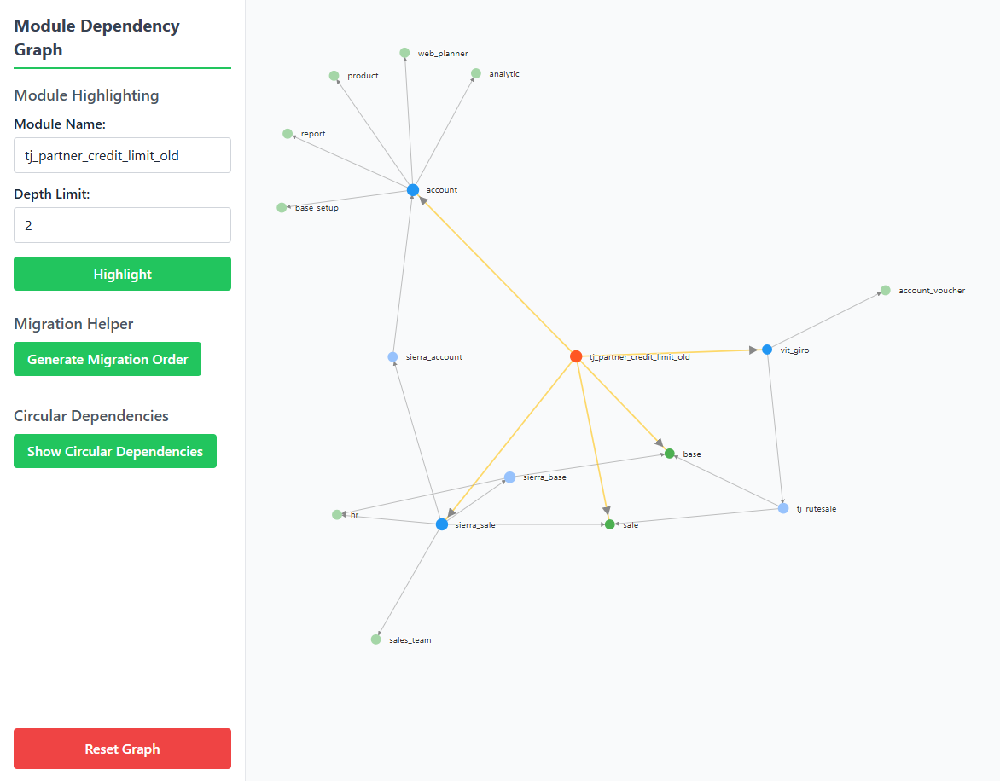
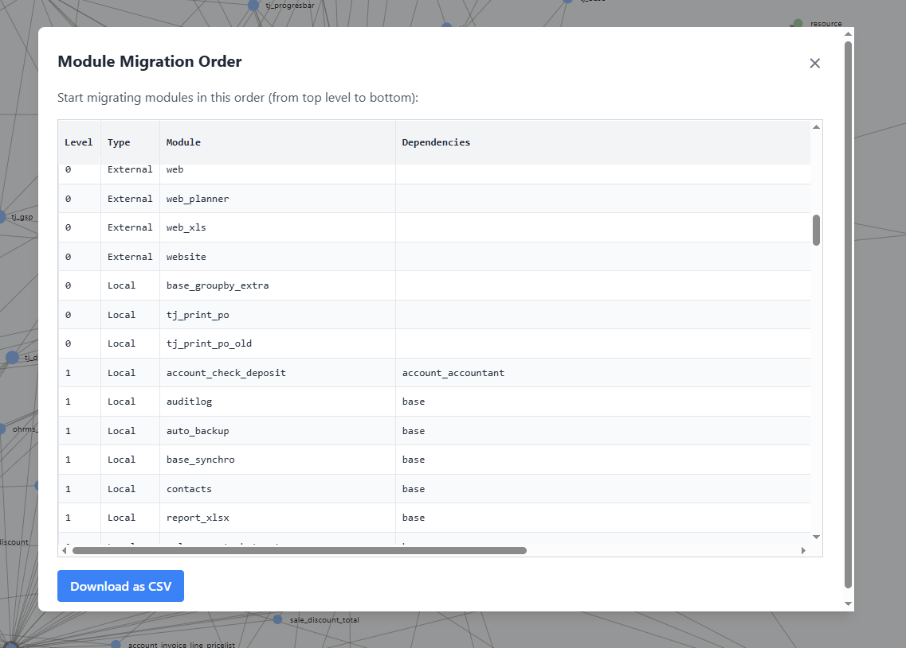
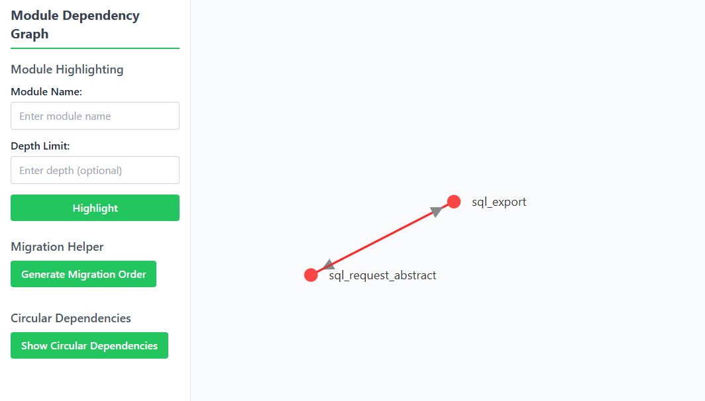

# Odoo Module Dependency Graph
A visualization tool for Odoo module dependencies to help with migration planning and understanding module relationships.


## Setup
1. Clone this repository.
2. Run this command:

   ```
   node convert_to_json.js
   ```

3. enter the path to your Odoo addons folder.
4. The script will generate a `module_dependencies.json` file containing dependency data for all modules.
5. Open `index.html` in your browser.


## Module Highlighting
Highlight a specific module and visualize its dependencies:

- Enter a module name in the search box.
- Optionally specify a depth limit to control how many levels of dependencies are shown.
- Click "Highlight" to focus the graph on the selected module.



## Migration Helper
Help you plan module migrations by generating a structured order:

- Click "Generate Migration Order" to create a table of modules ranked by dependency levels.
- Level 0 contains modules with no dependencies.
- Higher levels depend on modules from lower levels.
- Download the migration order as a CSV file.



## Circular Dependency Detection
Identify circular dependencies:
- Click "Show Circular Dependencies" to highlight modules involved in circular dependencies.

